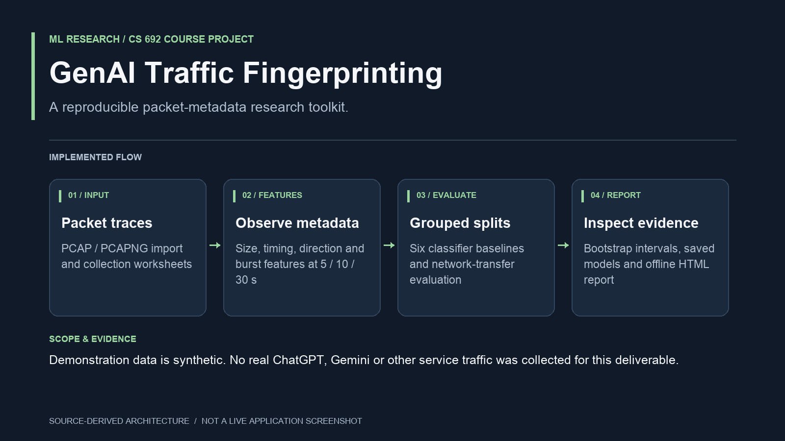

# Fingerprinting Human–GenAI Multimedia Traffic



**Implementation overview:** A reproducible packet-metadata research toolkit. [Source map and scope](docs/PORTFOLIO.md).

Demonstration data is synthetic. No real ChatGPT, Gemini or other service traffic was collected for this deliverable.

A runnable CS 692 research project for Shaik Mohammad Fardeen. It classifies known service/mode labels from packet sizes, timing, direction and bursts. It includes capture tooling, PCAP/PCAPNG import, collection worksheets, grouped dataset validation, six model/baseline comparisons, early-window classification, network-transfer evaluation, bootstrap intervals, saved models and a standalone offline report.

**The demo run is synthetic. Its scores are software checks, not evidence about ChatGPT, Gemini, or any other actual service. No real traffic was collected for this deliverable.**

## Start in five minutes

Clone this repository and use Python 3.11 or newer:

```bash
git clone https://github.com/smfardeen7/fingerprint-GENAI.git
cd fingerprint-GENAI
python3 -m venv .venv
source .venv/bin/activate
python -m pip install -e .
python -m genai_fingerprint demo --out runs/demo
```

On Windows activate with `.venv\Scripts\activate`; use `python` instead of `python3` if needed. Windows/macOS can run offline import, training and prediction. Live gateway capture and network emulation require Linux. Installing dependencies requires internet access; subsequent demo/training/report steps are local.

Open `runs/demo/evaluation/report.html` in a browser. It works offline, includes embedded figures, and lets you filter comparison rows. The demo usually takes a few minutes, depending on the machine. Output directories are never silently overwritten: choose a new name for each experiment.

The demo command generates **360 synthetic sessions**, 1,080 prefix rows, six classifier families at three horizons in two experiments, and one saved model per horizon under `runs/demo/`. Generated datasets and models are excluded from Git; regenerate them with the command above. The run records dependency versions in `summary.json`.

## Predict from a capture

The generated demo PCAP contains synthetic Ethernet/IPv4/UDP packets. Its test device is `192.0.2.10`, and the active start time is `116000`.

```bash
python -m genai_fingerprint import-pcap runs/demo/data/sample.pcap \
  --device-ip 192.0.2.10 --out runs/sample_packets.csv

python -m genai_fingerprint predict \
  --model runs/demo/evaluation/models/fingerprint_30s.joblib \
  --packets runs/sample_packets.csv --ready-time 116000 \
  --duration 60 --provenance synthetic
```

Prediction prints the class, service, mode and model scores. Scores are **uncalibrated**, and the classifier always chooses among its known classes. Unknown applications may be misclassified. Synthetic-trained models explicitly reject inputs declared as real. Only load your own trusted `.joblib` files: that serialization format can execute code.

## What is implemented

| Stage | Included implementation |
|---|---|
| Collection planning | Seeded randomized 360-session worksheet, with scenario-group splits |
| Live capture | TShark wrapper, ready marker, timing sidecar and capture log |
| Packet import | Streaming classic PCAP and PCAPNG enhanced packet blocks; IPv4/IPv6, Ethernet/VLAN, RAW IP and Linux SLL/SLL2 |
| Registration | Import a completed session and append verified worksheet labels to a real manifest |
| Features | Volume, packet-length statistics, inter-arrival statistics, direction ratios and burst summaries |
| Observation time | One prefix per session at 5, 10 and 30 seconds |
| Baselines | Majority, volume-only logistic, size-only logistic, timing-only logistic, full logistic, random forest |
| Model selection | Hyperparameter/model selection on validation macro-F1 only |
| Evaluation | Macro-F1, class precision/recall, service/mode accuracy, AI false positives and confusion matrices |
| Robustness | Training on good-network data and testing held-out scenarios across profiles |
| Uncertainty | Paired scenario-group bootstrap for F1 and improvement over volume baseline |
| Explanation | Descriptive 30-second held-out permutation importance; no test-based retuning |
| Deliverables | Audited features, hashes, CSV metrics/predictions, JSON summary, PNG figures, offline HTML report and models |

## Collect your real dataset

Read [docs/COLLECTION.md](docs/COLLECTION.md) before using the capture commands. Confirm the two GenAI services and their voice/video availability with your mentor. The project does not modify provider applications, automate sign-in, or supply paid access.

```bash
# This worksheet already exists in configs; generate a fresh one if desired.
python -m genai_fingerprint plan --out configs/my_collection_plan.csv

# Once your phone is connected through your capture gateway:
python -m genai_fingerprint capture --interface YOUR_LAN_INTERFACE \
  --device-ip YOUR_PHONE_IP --out private/session.pcapng --duration 60
```

Use appropriate capture permissions on your Linux machine. Do not run the entire ML pipeline as root. The capture wrapper prints a ready marker after five seconds. Start the scripted interaction at that marker; the application should already be connected and idle. It records `ready_time` and `duration` in `private/session.pcapng.json` and statistics in the `.log` file. Unknown capture-drop counts remain null, rather than being invented as zero; inspect the capture statistics before registering.

Register each completed capture, using the **actual values** from the sidecar and log:

```bash
python -m genai_fingerprint register \
  --worksheet configs/collection_plan.csv --session-id g00-c0-p0 \
  --source private/session.pcapng --device-ip YOUR_PHONE_IP \
  --ready-time EPOCH_FROM_SIDECAR --duration DURATION_FROM_SIDECAR \
  --date YYYY-MM-DD --service ACTUAL_SERVICE_NAME \
  --device-id phone-01 --app-version ACTUAL_VERSION \
  --capture-drops VERIFIED_DROP_COUNT --dataset data/real
```

The example placeholders must be replaced. Register the matching worksheet row: never label a capture by its classifier prediction. The six labels are `ai_a_voice`, `ai_a_video`, `ai_b_voice`, `ai_b_video`, `conventional_voice`, and `conventional_video`. Service A/B are placeholders until you record actual services. A capture plan is not a dataset and is intentionally not accepted by the training pipeline.

When all partitions are complete:

```bash
python -m genai_fingerprint validate data/real/manifest.csv
python -m genai_fingerprint features data/real/manifest.csv --out runs/real_features
python -m genai_fingerprint train runs/real_features --out runs/real_experiment
```

Use `--provenance real` with a real-trained model to predict new real captures. There is no model API dependency: you are measuring the traffic generated by your test applications.

## Research integrity

- Twenty scenario groups are split 12/4/4. All classes, network variants, repetitions and prefixes from a group stay together. Dates must be disjoint and chronological across train, validation and test.
- Files with duplicate normalized packet traces are rejected, as are mixed real/synthetic datasets, missing classes, incomplete observation periods, invalid numeric data and altered feature exports.
- The parser uses test-device addresses only to determine direction. The ML matrix excludes IPs, ports, domain names, TLS identifiers, dates, labels and device IDs.
- Bursts use a predeclared 50 ms gap. `--burst-gap` can change it during pilot work. Freeze it before final extraction, and never select it by final test scores.
- Models are fitted on training data. Validation selects hyperparameters and the deployment model. No refitting or model choice uses final test scores. All candidate test scores are reported for transparency.
- Confidence intervals resample complete scenario groups. Four final test groups are a small sample; intervals can be unstable. Later-day and new-scenario effects are combined, not isolated causal estimates.
- The proposed targets (30-second macro-F1 ≥0.80 and ≥0.10 gain over volume-only) are research goals, not acceptance criteria for the software. Negative research findings remain valid.

## Tests

```bash
python -m unittest discover -s tests -v
```

Tests cover binary import, IPv6/VLAN/Linux headers, timestamp boundaries, prefix causality, feature allowlists, scenario/day leakage, duplicate traces, provenance checks, grouped bootstrap and isolated-network rollback. The complete `demo` command is the integration exercise.

See [docs/VALIDATION.md](docs/VALIDATION.md) for what was actually exercised in the build environment and what requires your Linux gateway.

## Files

- `genai_fingerprint/`: implementation and CLI (`python -m genai_fingerprint --help`).
- `configs/`: preregistration record and randomized real-data collection worksheet.
- `docs/COLLECTION.md`: collection protocol, scenario ideas and isolated network setup.
- `docs/DATA_SCHEMA.md`: field definitions and input guarantees.
- `tests/`: executable regression tests.
- `runs/demo/`: locally generated synthetic dataset, saved models and report (excluded from Git).

## Sources

1. Cheng et al. *Hello, GenAI? Dissecting Human to Generative AI Calling.* IMC 2025. https://doi.org/10.1145/3730567.3764441
2. Cheng et al. *Can You See Me, GenAI? Characterizing Video-Based Conversational Interaction with Generative AI.* Course-provided IMC 2026 paper. https://doi.org/10.1145/3777912.3839793
3. [TShark manual](https://www.wireshark.org/docs/man-pages/tshark.html).
4. [scikit-learn cross-validation documentation](https://scikit-learn.org/stable/modules/cross_validation.html).
5. [Linux netem manual](https://man7.org/linux/man-pages/man8/tc-netem.8.html).

The papers motivate the feature families; the synthetic generator is an engineering fixture and is not calibrated from their measurements.
